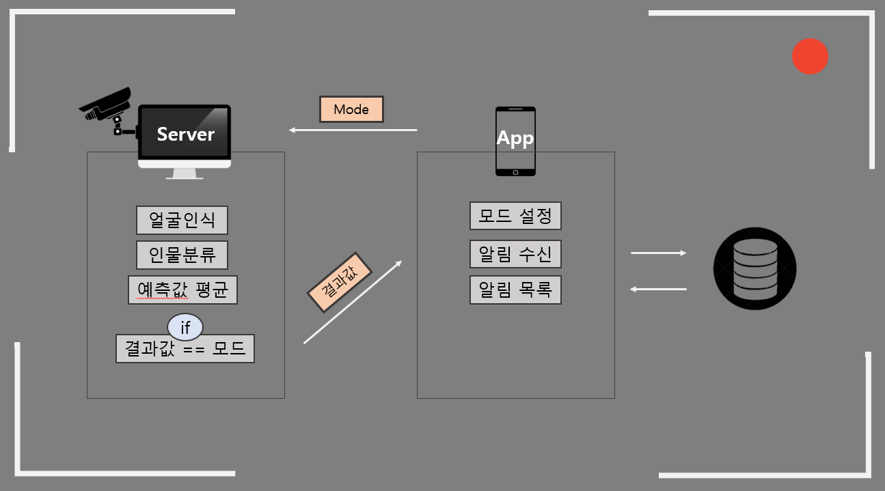
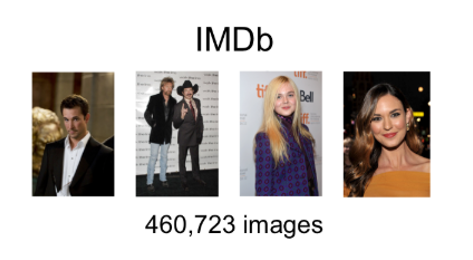
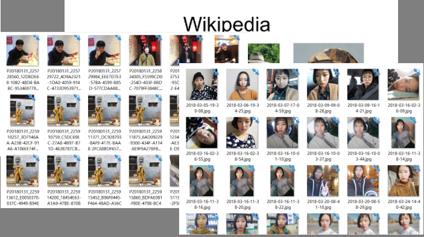
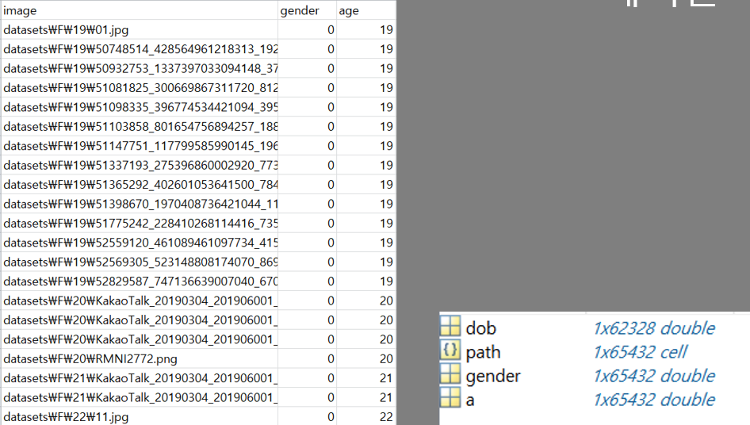
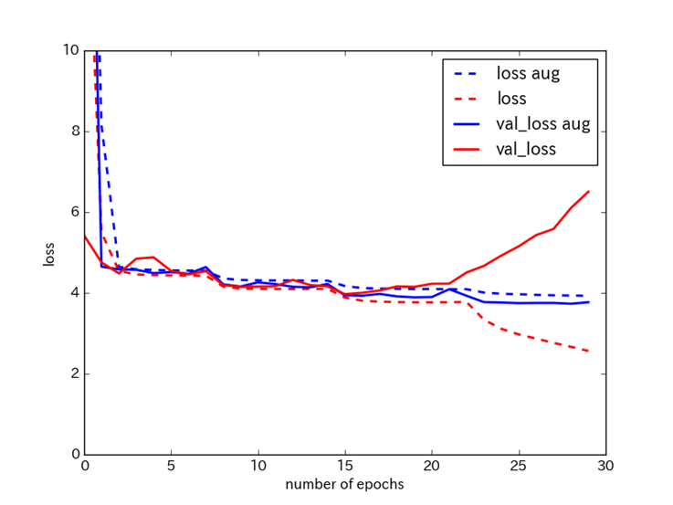
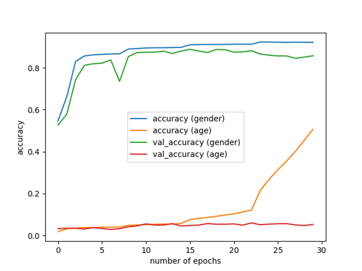
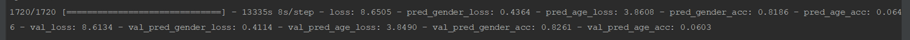
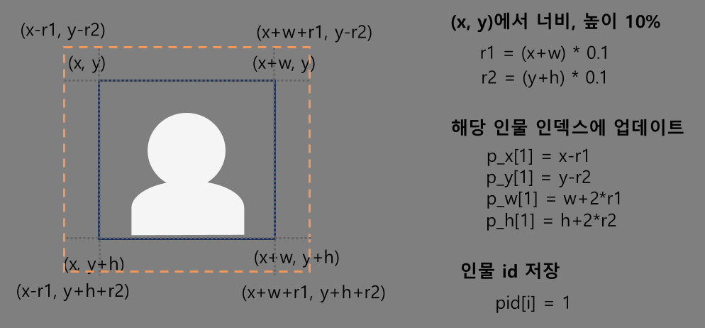
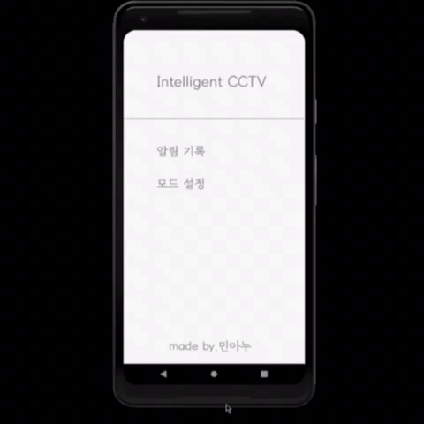
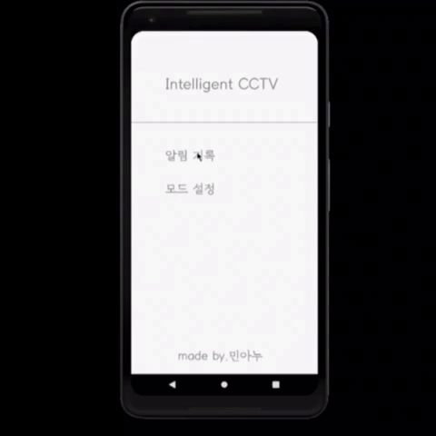

# AI_CCTV

 

## AI_CCTV 서비스 개요
이 프로젝트는 CCTV 영상을 분석하여 실시간으로 사람의 성별과 나이를 예측하고, 이를 시간별로 기록하여 로그를 생성하는 시스템입니다. AI 딥러닝 모델을 활용하여 얼굴 인식 기술과 함께 성별 및 연령대 추정을 진행하며, 추출된 데이터는 데이터베이스에 저장되어 시간대별 통계를 확인할 수 있습니다.

### 프로젝트 기간
- 2019.09.02 - 2020.05.04

### 팀원 소개

| 이름   | 역할/포지션               | 설명                                                                                                                                      |
|--------|----------------------------|-----------------------------------------------------------------------------------------------------------------------------------------|
| 노누리 | 팀장, Back-End, AI          | Keras를 활용하여 AI 모델 개발을 주도하였으며, Back-End 시스템의 설계와 구현을 총괄. 또한, 서버와 AI 모델의 통합 및 최적화를 담당.   |
| 김아현 | Back-End 보조, AI 총괄       | 시스템의 하드웨어 환경 설정 및 Back-End 보조 작업을 수행. AI 데이터셋 구축과 데이터 라벨링, AI 모델 학습 및 지름 측정 알고리즘 구현을 담당.  |
| 김민영 | Front-End, 통신             | Front-End 개발과 UI 구현을 담당하며, 앱과 AI 모델 간의 TCP 통신을 구축. 데이터 전송 및 통신 안정성을 확보하는 작업을 수행.          |

 

## 시스템 구성도

## 모델 소개

  

    
● 기존 모델 데이터

    
  

  

    
● 새로 추가한 데이터

    
  

 
 

레이블 처리

 
 

<table>
  <tr>
    <td style="text-align: center;">
      
● 기존 모델 데이터

      
    </td>
    <td style="text-align: center;">
      
● 새로 추가한 데이터

      
    </td>
  </tr>
</table>

LOSS 성별 – 0.4364 나이 – 3.8608 
ACCURACY 성별 – 0.8186 나이 – 0.0646

## 기능 소개

### 실제 화면

  
  
<em>모드 설정</em>

  
  
<em>분석</em>

  
  
<em>로그 확인</em>

